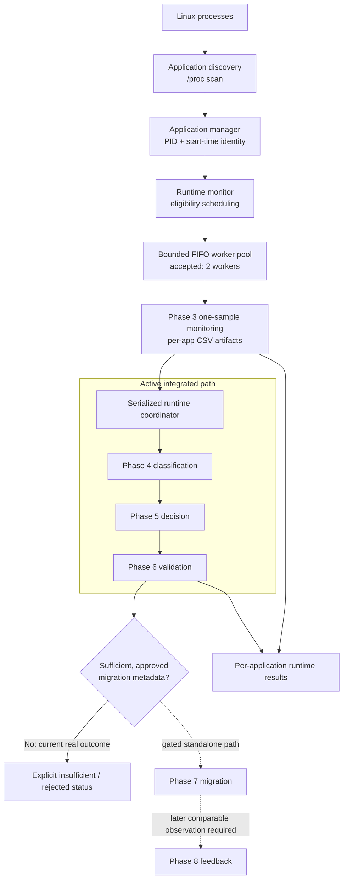
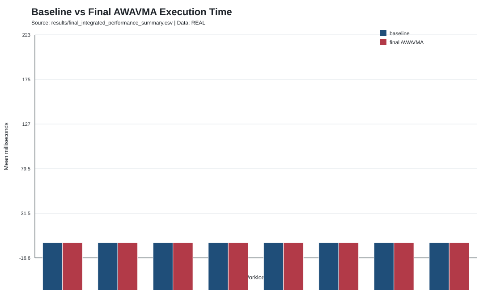
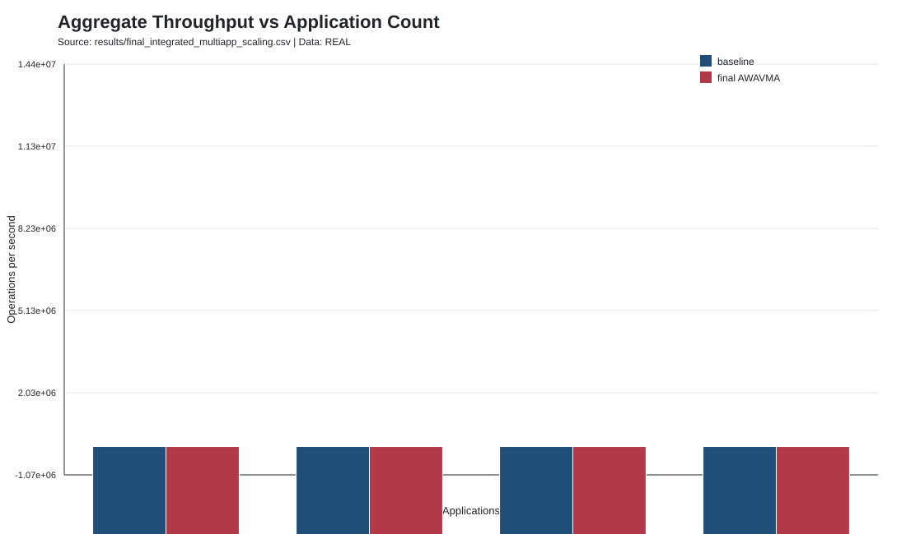
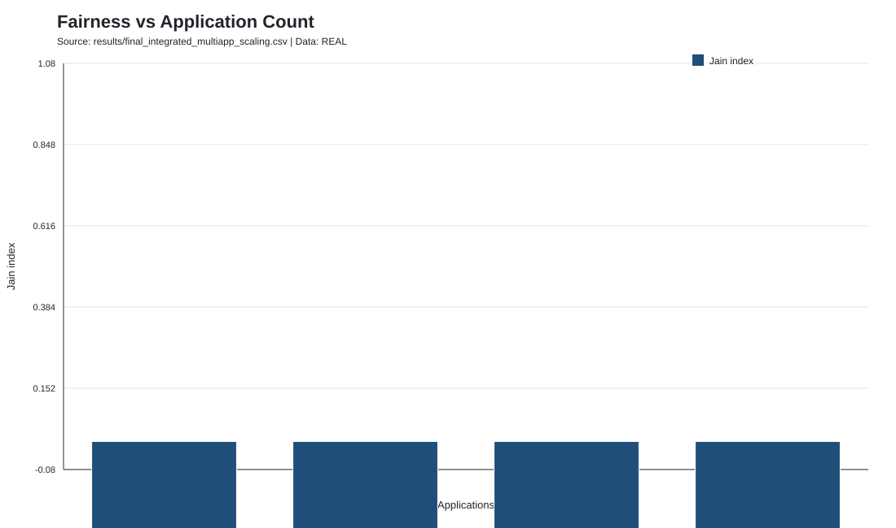
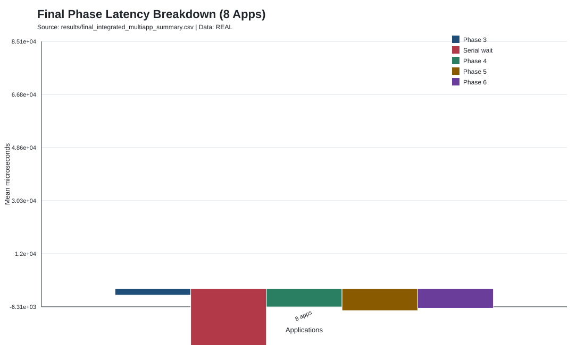
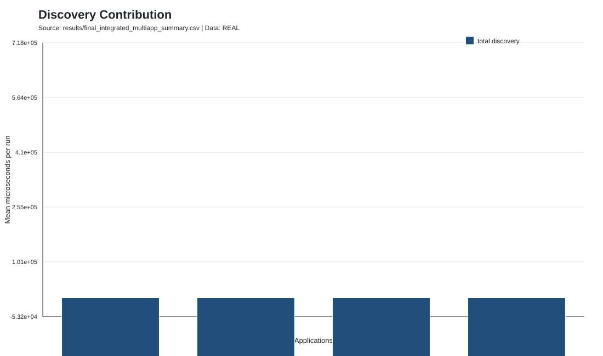

# AWAVMA

## Adaptive Workload-Aware Virtual Memory Allocation for Multi-Core Architectures

**AWAVMA** is a C11/Linux research prototype for observing application workload behavior and safely driving NUMA placement-related decisions through an integrated runtime pipeline.

| At a glance | Verified current state |
|---|---|
| Implementation | C11, POSIX threads, Python 3 standard-library evaluation scripts |
| Platform focus | Linux, `/proc`, CPU affinity, and NUMA-aware interfaces where available |
| Accepted runtime | Foreground `bin/awavma-runtime`; 2 Phase 3 workers; FIFO; 100 ms monitoring; 250 ms discovery; serialized Phase 4-6 coordinator |
| Evaluation status | Single-NUMA-node runtime overhead and scaling measured; multi-NUMA placement benefit not yet evaluated |

[Overview](#overview) · [Architecture](#system-architecture) · [Results](#current-performance-results) · [Build](#build) · [Testing](#testing) · [Documentation](#documentation-and-results)

## Overview

On multi-core NUMA systems, where an application executes and where its pages reside can materially affect latency, bandwidth, and interference. Default or static placement policies may not reflect changing workload behavior, but acting on incomplete observations can be worse than taking no action.

AWAVMA explores an evidence-driven control path for this problem. It discovers Linux processes, samples process and thread state, classifies explicit workload-access observations, produces a placement-related decision, and applies confidence, return-on-investment, and safety checks before any migration is eligible. Its feedback component can update bounded per-application decision state from valid before/after migration outcomes.

The accepted integrated runtime actively performs discovery, one-sample monitoring, classification, decision processing, and validation coordination. On the current host, the monitor does not emit genuine page-level access-frequency evidence, so real runtime outcomes correctly remain `INSUFFICIENT`. Phase 7 migration and Phase 8 feedback are implemented and tested as separate modules, but are deliberately not executed by the accepted runtime without legitimate migration metadata and a later comparable observation.

## Key Features

| Capability | Implementation evidence |
|---|---|
| Workload generation | Configurable pthread benchmark with sequential, random, hot, moderate, cold, mixed, changing, local, and remote patterns. |
| Application discovery | `/proc` scanner records PID, parent PID, process identity, executable path, and start-time ticks. |
| Identity-safe runtime | Applications are keyed as `APP_<pid>_<start_time>`; target PID mode resolves and preserves start-time identity to prevent PID-reuse confusion. |
| Continuous sampling | Runtime schedules one Phase 3 sample per due application, captures process and per-thread metrics, and detects terminated targets. |
| Bounded concurrency | A pthread worker pool executes Phase 3 jobs through a bounded FIFO ring queue; the accepted configuration has two workers. |
| Workload classification | Explicit access signal classification with decay, rolling window, thresholds, and hysteresis; unavailable access remains explicit. |
| Explainable decisions | Per-application weighted memory/thread action scoring with bounded biases, histories, and `NO_MIGRATION`/insufficient outcomes. |
| Validation and safety | Confidence, ROI, and safety gates require complete evidence and can veto a migration request. |
| Migration framework | Authorized thread-affinity migration and guarded page-migration support with verification, locking, cooldown, and audit records. |
| Feedback adaptation | Bounded, application-specific feedback updates based on valid migration outcomes and comparable before/after metrics. |
| Instrumentation and evaluation | `AWAVMA_PROFILE` build path, final integrated re-profiling, cadence study, multi-application scaling, and deterministic SVG reports. |

## System Architecture



Discovery is decoupled from the scheduling loop and defaults to every **250 ms** in the accepted runtime; monitoring is due every **100 ms**. Phase 3 jobs can run in parallel, while the coordinator processes Phase 4, Phase 5, and Phase 6 serially. This protects current persistence and lifecycle boundaries. Each application receives an identity-keyed Phase 3 file plus isolated `apps/<app_id>/cycles`, state, history, and log artifacts beneath the runtime root.

## Runtime Pipeline / Project Phases

| Phase | Responsibility | Principal components | Current status |
|---|---|---|---|
| 2 | Generate controlled memory workloads and optional NUMA placement requests | `src/benchmark.c`, `include/benchmark.h` | Implemented; benchmark build is environment-limited on the evaluated host because `numa.h` is absent. |
| 3 | Observe process, memory, NUMA, and per-thread state | `src/monitor.c`, `src/runtime_monitor.c` | Active in runtime; experimentally validated on the single-node host. |
| 4 | Classify explicit access observations with decay/window/hysteresis | `src/classifier.c` | Active in runtime; real monitor input lacks an access-frequency column, so it produces unavailable classification evidence. |
| 5 | Select memory, thread, or no-migration action | `src/decision.c` | Active in runtime; real pipeline safely returns insufficient decision signal. |
| 6 | Apply confidence, ROI, and safety gates | `src/validation.c`, `config/awavma.conf` | Active coordinator stage; validation does not execute migration. |
| 7 | Execute approved affinity/page migration requests | `src/migration.c` | Implemented and controlled-tested; gated in accepted runtime pending valid metadata and multi-node hardware. |
| 8 | Learn from valid migration outcomes | `src/feedback.c` | Implemented and controlled-tested; gated in accepted runtime pending a valid before/migration/after sequence. |
| 9 | Generate integrity-checked SVG visualizations | `scripts/generate_graphs.py` | Implemented evaluation stage; read-only with respect to prior phase state. |
| 10 | Characterize runtime cost and scalability | `scripts/run_final_integrated_performance.py` | Completed for current single-node runtime; not a multi-NUMA benefit comparison. |

## Implementation Highlights

- **One-sample monitoring jobs:** the runtime calls `monitor_run_pid_once()` per due application rather than assigning a worker to a process until it exits. An in-flight flag prevents overlapping samples for the same identity.
- **Safe lifecycle handling:** discovery excludes PID 1 by default, skips kernel/zombie processes, and reads `/proc/<pid>/stat` start-time ticks. The manager marks a changed PID/start-time pair as reuse; workers revalidate the exact identity before sampling.
- **FIFO and bounded backpressure:** `src/worker_pool.c` uses a fixed-capacity ring queue and records deferrals/queue-full events instead of silently overcommitting work.
- **Isolation before throughput:** runtime processing writes app-specific cycle, state, history, output, and log paths. The Phase 4-6 coordinator remains serialized because Phase 5 persistence and Phase 6 process-global lifecycle/logger state are not a safe shared concurrent path.
- **No inferred hotness:** unavailable cache counters and absent access signals are represented as unavailable, not converted into invented page-level locality evidence. The classifier and decision engine propagate this to insufficient outcomes.
- **Profile-gated instrumentation:** timing scopes are compiled when `-DAWAVMA_PROFILE` is enabled by profiling targets. Production analysis retained subprocess Phase 4/5/6; an experimental in-process Phase 4 adapter improved local timing but regressed end-to-end throughput and was rejected.

## Current Performance Results

The accepted measurements are **runtime overhead and scalability measurements**, not a comparison against a conventional multi-node NUMA policy. The final re-profile used subprocess Phases 4-6, a serialized coordinator, two workers, 100 ms monitoring, 250 ms discovery, and 1000 ms evaluation.

| Metric | Final measured result |
|---|---:|
| Mean single-application execution-time overhead | **+6.613%** across eight workloads |
| Aggregate throughput change, 1 / 2 / 4 / 8 apps | **-5.322% / -2.920% / -0.792% / -1.372%** |
| Eight-app Jain fairness index | **1.000** |
| Eight-app queue saturation / deferrals | **0 / 0** |
| Accepted discovery cadence improvement | **65.4%** lower total discovery time at 250 ms vs 50 ms |
| Mean discovery latency at accepted cadence | **249.4 ms**, within the configured study gate of <=350 ms |
| Main eight-app bottleneck | **193,588.948 us** serial-entry wait |
| Final integration evidence | **81 records, 0 failures** |
| System regression evidence | **53 pass, 0 fail, 1 environment-limited** |

The final report also records the main downstream wall times at eight applications: Phase 5 subprocess wall time was 19,086.273 us, Phase 6 was 16,624.410 us, and Phase 4 was 16,417.578 us. The dominant cost is admission to the serialized coordinator rather than worker-pool saturation.



*Final workload-level baseline and integrated execution-time means.*



*Aggregate throughput change for the accepted two-worker runtime.*



*Measured Jain fairness remains high through eight simultaneous applications.*



*The serialized admission wait dominates the final eight-application pipeline attribution.*



*Controlled discovery-cadence study supporting the accepted 250 ms configuration.*

See the [final integrated report](results/final_integrated_performance_report.md), [final CSV summary](results/final_integrated_performance_summary.csv), and [multi-application report](results/multi_application_performance_report.md) for methodology and workload-level data.

## Current Hardware Evaluation Status

The final evaluation environment had **8 CPUs and one NUMA node (`node0`)**. `libnuma` was available, while `numa.h`, `numaif.h`, and permitted cache-counter access were unavailable. Consequently, the project has measured the behavior, overhead, fairness, and scalability of the software runtime on this host, but has **not** measured remote-memory placement benefit or a real cross-node memory migration outcome.

The runtime architecture, migration framework, validation boundary, and feedback engine are implemented. Their claimed placement benefit remains intentionally bounded: a real machine with at least two NUMA nodes, valid placement/page metadata, and a conventional NUMA baseline is required to evaluate remote-versus-local behavior and AWAVMA-enabled migration benefit.

## Repository Structure

```text
AWAVMA/
├── config/       Runtime and validation/migration/feedback configuration
├── docs/         Architecture audit, single-node evaluation, prior README
├── graphs/       Generated SVG visualizations
├── history/      Persisted bounded decision/feedback history
├── include/      Public C interfaces and shared types
├── results/      CSV measurements and Markdown reports
├── scripts/      Python evaluation, summarization, and graph tooling
├── src/          Benchmark, phase modules, and integrated runtime
├── state/        Runtime-generated mutable state
├── tests/        C/Python tests, fixtures, integration, and regression runners
├── Makefile
└── README.md
```

| Path | Purpose |
|---|---|
| `src/`, `include/` | C implementations and interfaces for benchmark through runtime orchestration. |
| `config/` | `awavma.conf` controls Phases 6-8 bounds and gates; `runtime.conf` is a manager configuration reference. The accepted runtime is configured by its CLI. |
| `tests/` | Component fixtures, continuous-monitoring coverage, integration runners, and performance checks. Controlled inputs are explicitly not real NUMA results. |
| `results/`, `graphs/` | Accepted reports, CSV summaries, and generated figures. `results/*profile_events.csv` is tracked with Git LFS. |
| `history/`, `state/`, `logs/` | Persistent histories, mutable runtime state, and generated logs. `state/*.csv` and logs are ignored. |
| `bin/` | Generated executables; ignored except for its placeholder. |

## Build Requirements

| Requirement | Why it is needed |
|---|---|
| Linux with `/proc` | Discovery, monitoring, process identity validation, and Linux scheduling interfaces. |
| `gcc` or compatible C11 compiler, `make` | Build system uses `-std=c11`, POSIX threads, and GNU/Linux extensions. |
| POSIX threads and math library | Used by runtime workers and phase modules. |
| Python 3 | Evaluation, report, and graph scripts use the standard library. |
| `libnuma` development header/library | Required to build the benchmark (`<numa.h>`); the Makefile links `-lnuma` when the header exists. `numactl` is useful for topology inspection. |
| Git LFS (optional) | Needed only to obtain full LFS-managed raw profiling datasets. |

On Ubuntu, the legacy project instructions identify `build-essential`, `libnuma-dev`, and `numactl` as the relevant packages. Before multi-NUMA experiments, inspect the host with `lscpu` and `numactl --hardware`.

## Build

```bash
make
make awavma-runtime
```

| Target | Purpose |
|---|---|
| `make` | Builds the core phase executables and generates Phase 9 graphs. |
| `make awavma-runtime` | Builds classifier, decision, validation, and the integrated runtime. |
| `make test-runtime` | Runs runtime and target-filter tests. |
| `make test-continuous-monitor` | Runs discovery, manager, worker-pool, and continuous-monitoring coverage. |
| `make test-final-integration` | Publishes final Phase 2-9 integration evidence. |
| `make test-system-regression` | Runs the system-wide regression report. |
| `make profile-awavma-runtime` | Builds the instrumented runtime with `AWAVMA_PROFILE`. |
| `make final-integrated-performance` | Re-runs the accepted final integrated performance workflow. |
| `make multi-application-performance` | Runs the multi-application performance driver. |
| `make graphs` | Generates Phase 2-9 SVG graphs. |
| `make clean` | Removes listed generated executables. |

## Running AWAVMA

Build the runtime, then either allow discovery of available processes or provide explicit target identities. `--pid` may be repeated and records each PID's start-time ticks before the runtime starts.

```bash
# Run a five-second foreground evaluation with the accepted timing defaults.
bin/awavma-runtime --duration-ms 5000

# Restrict the runtime to an existing application PID.
bin/awavma-runtime --pid 12345 --duration-ms 5000

# Tune supported runtime parameters and direct generated artifacts elsewhere.
bin/awavma-runtime \
  --pid 12345 \
  --duration-ms 10000 \
  --monitor-ms 100 \
  --discovery-interval-ms 250 \
  --evaluation-ms 1000 \
  --workers 2 \
  --queue-capacity 64 \
  --root-dir results/runtime-demo \
  --config config/awavma.conf
```

`--duration-ms 0` runs until `SIGINT` or `SIGTERM`. `--phase4-mode in-process` exists for investigation only; the accepted production configuration is `subprocess`. Runtime artifacts default to `results/runtime/`.

For standalone observation:

```bash
bin/monitor --pid 12345 --interval 100 \
  --output results/monitoring_results.csv \
  --thread-output results/monitoring_threads.csv \
  --log logs/monitor.log
```

The benchmark supports explicit thread and memory NUMA-node options, but remote mode must only be run when the specified nodes exist and are permitted by the environment.

## Testing

The suite covers discovery, manager lifecycle, FIFO worker behavior, monitoring, identity changes, target disappearance, classifier/decision/validation behavior, migration guards, feedback state, graph integrity, integration, and performance-report validation.

```bash
make test-application-discovery
make test-application-manager
make test-worker-pool
make test-continuous-monitor
make test-validation
make test-migration
make test-feedback
make test-runtime
make test-discovery-cadence
make test-phase46-pipeline
make test-final-integration
make test-system-regression
```

The recorded final integration run contains 81 records with zero failures. The recorded system regression run contains 53 passes, zero failures, and one environment-limited benchmark result caused by missing `numa.h`; controlled fixtures remain labeled as controlled throughout the reports.

## Performance Evaluation Methodology

The accepted final re-profile used eight single-application workloads: sequential, random, hot, moderate, cold, mixed, changing, and local. Each used 2 threads, 8 MiB, 1,000,000 iterations, seed 12345, five warm-ups, and five deterministic interleaved baseline/integrated measured pairs.

The primary multi-application study used the mixed pattern, one thread and 8 MiB per application, a calibrated fixed 17,841,231 iterations per thread, 1/2/4/8 applications, two workers, three warm-ups, and five deterministic interleaved pairs. Launch skew was recorded because the frozen benchmark has no external pre-execution barrier. Measurements are reported as observed values, not statistical-significance claims. Full details are in the [final report](results/final_integrated_performance_report.md) and [single-node evaluation](docs/current_single_node_performance_evaluation.md).

## Design Principles / Safety

- **Evidence before action:** missing access, decision, or migration metadata remains unavailable or insufficient; it is never substituted from unrelated CPU, RSS, page-fault, or pattern labels.
- **Validation before execution:** Phase 7 requires an authorized Phase 5 action and Phase 6 approval; invalid targets, missing page metadata, unsafe states, and cooldown/lock conflicts are reported explicitly.
- **Process identity over PID alone:** `/proc` start-time ticks are used by discovery, scheduling, target filtering, and worker revalidation. A disappeared or changed target becomes `TARGET_GONE`, not a new target.
- **Per-application boundaries:** app IDs and artifact roots prevent mixed monitoring files and separate state/history for the integrated runtime path.
- **Auditable, bounded persistence:** phase modules retain histories with bounded size/age and use temporary-file plus rename replacement where applicable.
- **Explicit data provenance:** graph generation excludes unavailable/non-finite values, keeps real and controlled data distinct, and does not join cross-phase rows by order alone.

## Known Limitations

- The accepted evaluation host has one NUMA node; no remote-node placement gain or real cross-node page migration result has been demonstrated.
- Current Phase 3 output does not supply page-level access frequency. Real Phase 4/5 processing therefore safely stops at insufficient evidence.
- The active Phase 4-6 coordinator is serialized. At eight applications, serial-entry wait is the primary measured scalability bottleneck.
- Phase 4/5/6 use subprocesses in the accepted runtime. The experimental Phase 4 in-process mode was rejected after whole-pipeline throughput regressions.
- Cache-reference and cache-miss monitoring depends on permitted `perf_event_open()` access; this was unavailable in the recorded environment.
- The runtime is Linux-specific and depends on `/proc` and Linux scheduling/NUMA interfaces. It is a foreground executable, not a deployed system daemon.

## Future Work

1. Evaluate on a machine with two or more NUMA nodes, validate topology and page metadata, and establish default/Linux NUMA and controlled local/remote baselines.
2. Measure authorized Phase 7 cross-node migration and Phase 8 adaptation using a real before/migration/after observation sequence.
3. Reduce the serialized coordinator bottleneck while preserving Phase 5 per-application persistence isolation and Phase 6 lifecycle/logging semantics.
4. Extend workload and real-application coverage once multi-NUMA hardware evidence is available.

## Documentation and Results

| Resource | Description |
|---|---|
| [Final integrated performance report](results/final_integrated_performance_report.md) | Accepted runtime configuration, measured overhead, fairness, bottlenecks, and regression ledger. |
| [Single-node performance evaluation](docs/current_single_node_performance_evaluation.md) | Hardware boundary, claims supported today, and required next evaluation stage. |
| [Phase 10 final checkpoint](results/phase10_final_runtime_report.md) | Consolidated accepted production runtime checkpoint. |
| [Multi-application report](results/multi_application_performance_report.md) | Earlier scaling study across worker counts and application counts. |
| [Phase 4-6 pipeline investigation](results/phase46_pipeline_report.md) | Concurrency audit and rejected Phase 4 direct-call candidate. |
| [Phase 5/6 investigation](results/phase56_investigation_report.md) | Subprocess, persistence, logging, and lifecycle timing analysis. |
| [Architecture audit](docs/final_architecture_audit.md) | Component interface and boundary audit predating the final orchestration path. |
| [Final performance figures](graphs/final-integrated-performance/) | Generated visual summary of accepted integrated results. |

## Research Context / Implementation Contribution

AWAVMA explores how continuous application-level observation can be connected to placement-related decisions without treating incomplete operating-system telemetry as proof of memory locality. The current prototype integrates monitoring, classification, explainable decision generation, validation, guarded migration capability, feedback logic, runtime scheduling, and performance instrumentation into one research-oriented control path.

This differs conceptually from a one-time static NUMA binding because the design is intended to react to new observations while maintaining explicit safety boundaries. The present evidence establishes runtime behavior and cost on a single-node system; it does not establish that the approach improves multi-node NUMA performance.

## Project Status

| Area | Status | Current evidence |
|---|---|---|
| Benchmark and standalone phase modules | Implemented | Source, CLI targets, fixtures, and integration coverage. |
| Discovery, identity protection, monitoring, worker pool | Implemented and tested | Runtime/continuous-monitoring tests and final integration evidence. |
| Integrated Phase 3-6 runtime path | Implemented and measured | Accepted serialized subprocess configuration and final re-profile. |
| Migration framework and feedback engine | Implemented; safety-gated in runtime | Controlled tests pass; real runtime lacks required migration/after-observation evidence. |
| Profiling, graphs, performance framework | Implemented and measured | Final reports, CSV summaries, and SVG figures. |
| Multi-NUMA benefit validation | Pending hardware evaluation | Requires a real 2+ NUMA-node machine. |
| Daemon deployment | Not implemented | Current runtime operates in the foreground. |

## Authors

No authoritative author list is present in the repository.

## License

No license has been specified yet.
